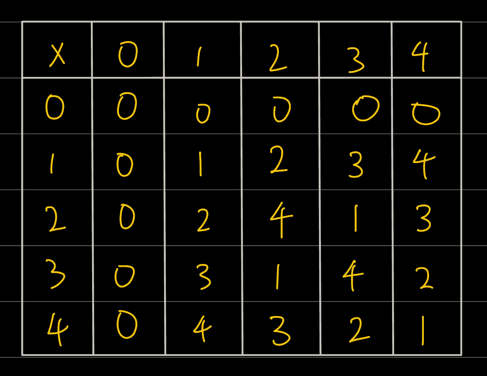
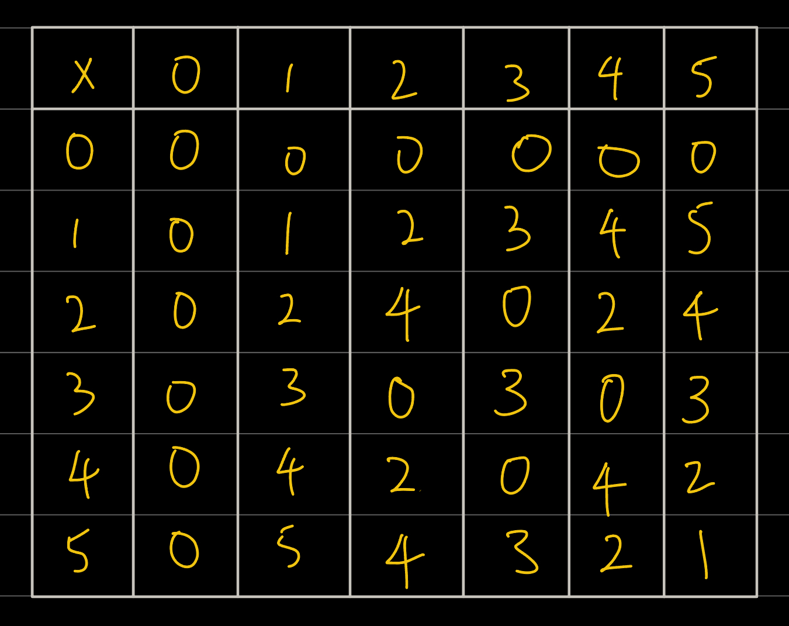

Finite fields is so interesting.

But first what is a field? You could look that up on [Wikipedia](<https://en.wikipedia.org/wiki/Field_(mathematics)>), there is no value in this post explaining that.

Perhaps what is more valuable is the **motivation** behind a field!

## A laymen's attempt on motivation behind fields.

You just came back from Japan.

- Japan was clean
- Japan has great public transport
- Japan had great food

You liked it and would like something simillar for your next vacation.

> I like **_countries_** that are
>
> - clean  
> - has great public transport 
> - has great food

Likewise in mathematics, we have different "number systems" (comparable to countries). We would like to preserve some "rules" (comparable to qualities) that makes it nice to work with!

> We like **_number systems_** that have
>
> - addition and multiplication  
> - identities and inverses for addition and multiplication 
> - additive and multiplicative commutativity  
> - are self-contained

#### But why do you like these in particular?

Well, maybe it will become apparent during the worked examples.

### Example of fields?

#### Real numbers

- we can add and multiply them
- additive and multiplicative inverses exist!

  > _$2.68 + (-2.68) = 0$_
  >
  > > the additive inverse is simply the negative version of numbers

  > $$5 \times \frac{1}{5} = 1$$
  >
  > > the multiplicative inverse is simply the reciprocal of the number

- reals are self contained (examples for non-fields will shine more light on this)

### Example of **_Non-fields_**?

#### Integers

- we can add and multiply them
- additive inverse exist!
  > $$5 + (-5) = 0$$
  >
  > > the additive inverse is simply the negative version of number
- **multiplicative inverse does not exist**
  > $$5 \times \frac{1}{5} = 1$$
  >
  > > the multiplicative inverse is the reciprocal of the number, however the reciprocal is ==NOT AN INTEGER!==
- Integers are not self contained
  > $$2 \div 5 = \frac{2}{5}$$
  >
  > > If we were to divide an integer with another integer , we might require another class of numbers (namely rationals), to describe the answer

## Enter Hero (Stage Left) i.e. Finite Fields

#### Integers can be finite fields.. just use modular arithmetic!

The catch is we have to use prime/powers of prime as modulus numbers!

let's consider modulus 5

the additive inverse of 3 is 3.. because

> $$ 3 + 3 = 6 \equiv 1 (\text{mod }5)$$

the multiplicative inverse of 3 is 2.. because

> $$ 3 \times 2 = 6 \equiv 1 (\text{mod }5)$$

here's the multiplication table for modulo 5

here's an interesting observation: except the rows and columns with zeroes, all the rest have all the numbers 01234 appearing exactly once

kinda like sudoku!

what if we tried doing this with modulo 6 (which is not a prime and not a power of a prime)?

it no longer has that sudoku qualities

which means multiplicative inverses may not exists for all numbers!

for example 2 has no multiplicative inverse.. because

> let $$x : 2 \times x \equiv 1 (\text{mod }6) \newline \Rightarrow x = \emptyset $$

caption: if we put into a box, the values of x that satisfy 2x = 1(modulo 6), we would get an empty box
