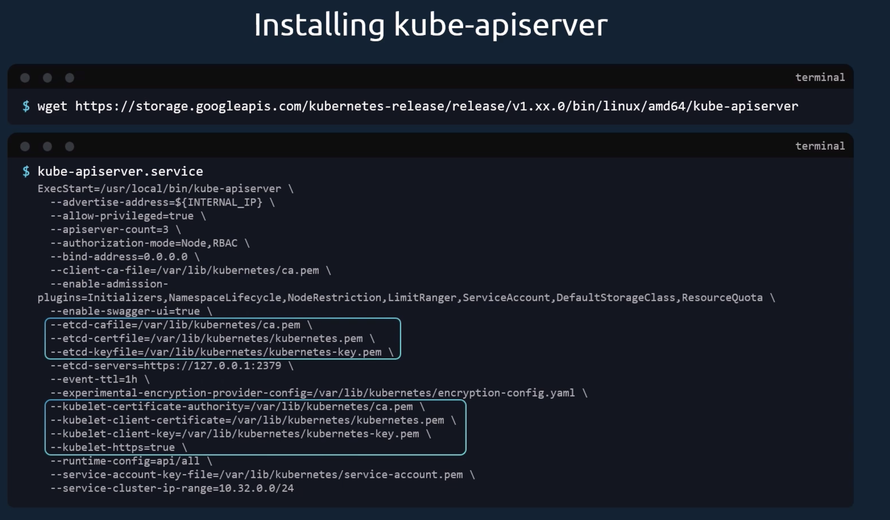
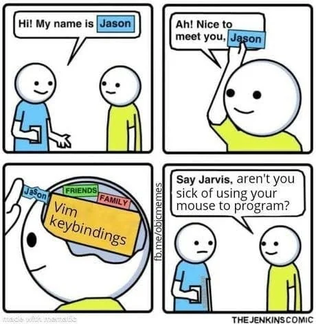
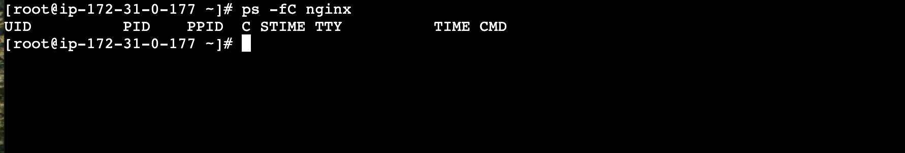
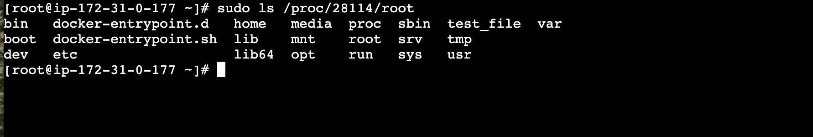

Came across a very good [YouTube playlist](https://www.youtube.com/playlist?list=PLyPJCkaAbecPfbYCQ9l0X0oO3NvmDIgAo) recently.

Chances are you, the reader,

- not click or bother with the playlist
- click into the playlist and think to yourself "Yeah naw, not going to watch all of that"
- look for some kind of summary to what the playlist is about

### So what is this playlist about, why should you watch it?

It's from datadog's channel, it's about Container Security.

If you are knowledgeable on Container Security, there's nothing for you here.

But if you are just starting out on this topic, you are in for a treat.

### My learning style

When learning something, I prefer understanding it fundamentally from the ground up.

For example, I'm currently preparing for CKA (Certified Kubernetes Administrator) exams, and I am expected to know how to configure the kube-apiserver



Well there are 2 ways we can go about this

1. Memorize it
2. Understand fundamentally or deeply what these configurations do

My style is always number 2, I hate to memorize things because I already have too much junk committed in my head.


<sub>That's why I typically start with "Hey there"</sub>

### you are long winded bro, can you get to the point?

If you find Container Security hard to understand, that's because you lack the fundaments.

This playlist goes through those fundamentals, in a clear and concise manner.

### Firstly, what is a container?

We all know that containers are sandboxed from others but how does that work?

It turns out in Linux they are just processes!

### Here's an experiment

- Spin up a Linux instance
- make sure it has docker installed
- go to the terminal.

do this:

```shell

ps -fC nginx

```



## what did we just do?

So we just asked to list out the processes (ps)

- in full format (-f),
- searching for a certain process name (-C),
- which goes by "nginx" (nginx)

and of course the output shows nothing. Unless you are already running a web server on this Linux insance, there's no reason for nginx to be running.

## step 2

run an instance of nginx using docker:

```shell


docker run --name webserver -d -p 8080:80 nginx

```

So that asks docker to

- run a container (docker run)
- whose name is going to be webserver (--name webserver)
- and run it in detached mode, i.e. i dont want to see the stdout stderr (-d)
- publish and map port 8080 on host machine to container port 80 (-p 8080:80)
- whose image is going to be nginx (nginx)

## step 3: let's do step 1 again and note the difference in output

run this again:

```shell

ps -fC nginx
```


one important thing to note is the process id (PID) of 28114.

Notice that the first row shows a user id (UID) of root with process ID 28114

The subsequent rows have different PIDs but they have the same PPIDs (parent process ID) of 28114

## now let's create a file inside the container

```shell


docker exec webserver touch /test_file
```

so this command asks docker to

- run a command into one of the containers (docker exec)
- whose name is webserver (webserver)
- and run command to create a new file (touch /test_file)

## finale: access the file without using docker command

so the usual way we can access the file is to use `docker exec` again.

but to show that the webserver container is nothing but a process on the OS, we are going to locate the file using `ls`

run this:

```shell

sudo ls /proc/28114/root
```

note: you might want to replace 28114 with the process id that you got from step 3



### Conclusion

Isn't that cool? You can actually get around the containers **_without_** using docker commands!

If you would like more cool tricks, do check out the full [YouTube playlist](https://www.youtube.com/playlist?list=PLyPJCkaAbecPfbYCQ9l0X0oO3NvmDIgA)

Cheers!
