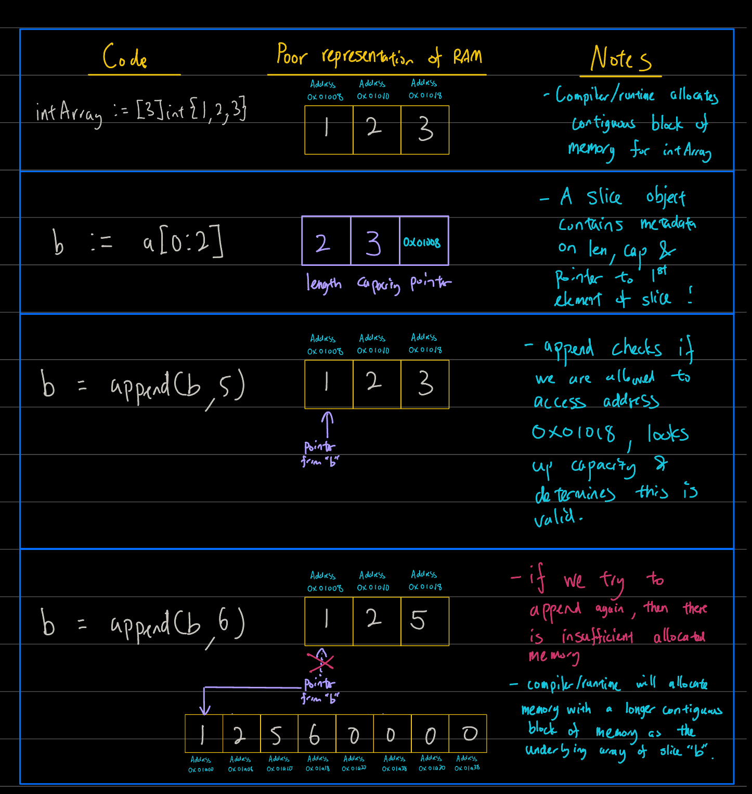

### Golang is a breath of fresh air coming from JavaScript

I like that it is opinionated.

It's as if a minimalist looked at C and just threw away as much things as possible.

### But it does come with it's own set of problems..

Colour me unimpressed, 2 to 3 weeks into learning golang, when I found out about slices.

Here are some footguns pertaining to slices.
<br>

### <span style="color: red">Problem 1a<span/>

```go
package main

import "fmt"

func main() {
  a:= []int{1,2,3}  // slice "a"
  b:= a[0:2]        // slice "b" is a subslice of slice "a"

  fmt.Println(a)
  fmt.Println(b)
}
```

```console

[1 2 3]
[1 2]
```

So far so good

Let's try to change 2nd element of slice "b"

```go
package main

import "fmt"

func main() {
  a:= []int{1,2,3}  // slice "a"
  b:= a[0:2]        // slice "b" is a subslice of slice "a"

  b[1] = 5 // We introduce this line of code
  fmt.Println(a)
  fmt.Println(b)
}
```

```console

[1 5 3] <-- we expected [1 2 3]
[1 5]   <-- we expected [1 5]
```

uh oh.

we've accidentally changed slice "a" while changing slice "b".

<br>

### <span style="color: green">Solution 1a<span/>

"Slices are like references to array" - [Tour of Go](https://go.dev/tour/moretypes/8)

When in rome, do as the romans do!

When writing golang, go as the gophers go!

i.e. this is a feature not a bug!

<br>

### <span style="color: red">Problem 1b<span/>


```go
package main

import "fmt"

func main() {
  a:= []int{1,2,3}  // slice "a"
  b:= a[0:2]        // slice "b" is a subslice of slice "a"

  b = append(b, 5) // We changed this line
  fmt.Println(a)
  fmt.Println(b)
}
```

Wanna guess the output?

<details>
<summary>Click to reveal!</summary>

output

```console

[1 2 5]
[1 2 5]
```

</details>

<br>

### <span style="color: orange">Let's explore problem 1b<span/>

It turns out slices have a hidden feature!

To show you, let's initialize slices using <code>make()</code>

```go
package main

import "fmt"

func main() {
  slice1 := make([]int, 5)     // initialize slice with length 5
  slice2 := make([]int, 0 , 5) // initialize slice with length 0 and 5 of something???

  fmt.Println(slice1)
  fmt.Println(slice2)
}
```

output

```console

[0 0 0 0 0]
[]
```

huh? what's with the 3rd argument of make?

according to [Tour of Go](https://go.dev/tour/moretypes/11) this is the capacity of a slice!

meaning <code> make([]type, length, capacity) </code>

so... let's answer 2 questions

#### <span style="color: orange">1. Why did compiler/runtime not assign new memory address to appended subslice (i.e. the new slice "b") </span>

Remember that slices are references to underlying array?

"b" has a capcaity of 3, because that's how much memory we can store in the underlying array!

Confused? let me demonstrate with a drawing.



#### <span style="color: orange">2. Why did it overwrite slice a?</span>

Refer to problem and solution 1a!

<br>

### <span style="color: green">Solution 1b<span/>

So the solution... depends on what your are trying to acheive.

#### <span style="color: lime">For the times you don't have to deal with capacity</span>

let me introduce a better way to slice.

```go
package main

import "fmt"

func main() {
  intArray := [3]int{1,2,3}
  b := intArray[0:2:2] // change here
}

fmt.Printf("Length: %d, Capacity: %d, Slice: %v\n", len(b), cap(b), b)
```

```console

Length: 2, Capacity: 2, Slice: [1,2]
```

#### <span style="color: lime"> For the other times..</span>

1. Allocate mental overhead (so punny) to conscientiously handle slice capacity.

2. Don't have multiple slices pointing to the same underlying array.. that's just asking for trouble

<br>

### <span style="color: red">Slice problem 1c<span/>

**Hey I thought we were done with problem 1.x ???**

Because capacity itself opens another can of worms..

```go
package main

import "fmt"

func main() {
  intArray := [5]int{3,1,4,1,5} // we create an int array

  a:= intArray[:3] // "a" will be a subslice of intArray
  fmt.Printf("Length: %d, Capacity: %d, Slice: %v\n", len(a), cap(a), a)

  // magic happens here
  a = a[:5]
  fmt.Printf("Length: %d, Capacity: %d, Slice: %v\n", len(a), cap(a), a)
}
```

```console

Length: 3, Capacity: 5, [3 1 4]
Length: 5, Capacity: 5, [3 1 4 1 5]
```

whoa.. we can restore length by reslicing!

**_folks, stay seated.. the performance is not over_**

```go
package main

import "fmt"

func main() {
  intArray := [5]int{3,1,4,1,5} // we create an int array

  b:= intArray[2:5] //  "b" is also a subslice of intArray
  fmt.Printf("Length: %d, Capacity: %d, Slice: %v\n", len(b), cap(b), b)

  // HUH? no magic here???
  b = b[0:]
  fmt.Printf("Length: %d, Capacity: %d, Slice: %v\n", len(b), cap(b), b)
}
```

```console

Length: 3, Capacity: 3, [4 1 5]
Length: 3, Capacity: 3, [4 1 5]
```

Apparently, slicing from the front reduces capacity..

<br>

### <span style="color:green">Solution 1c</span>

Building on solution 1b.

Capacity is not just the length of the underlying array.

Perhaps we can think about it as the number of available spaces from pointer address to end of array.

<br>

### <span style="color:red">Problem 2</span>

(Work in progress)
Reading vs writing empty slice
