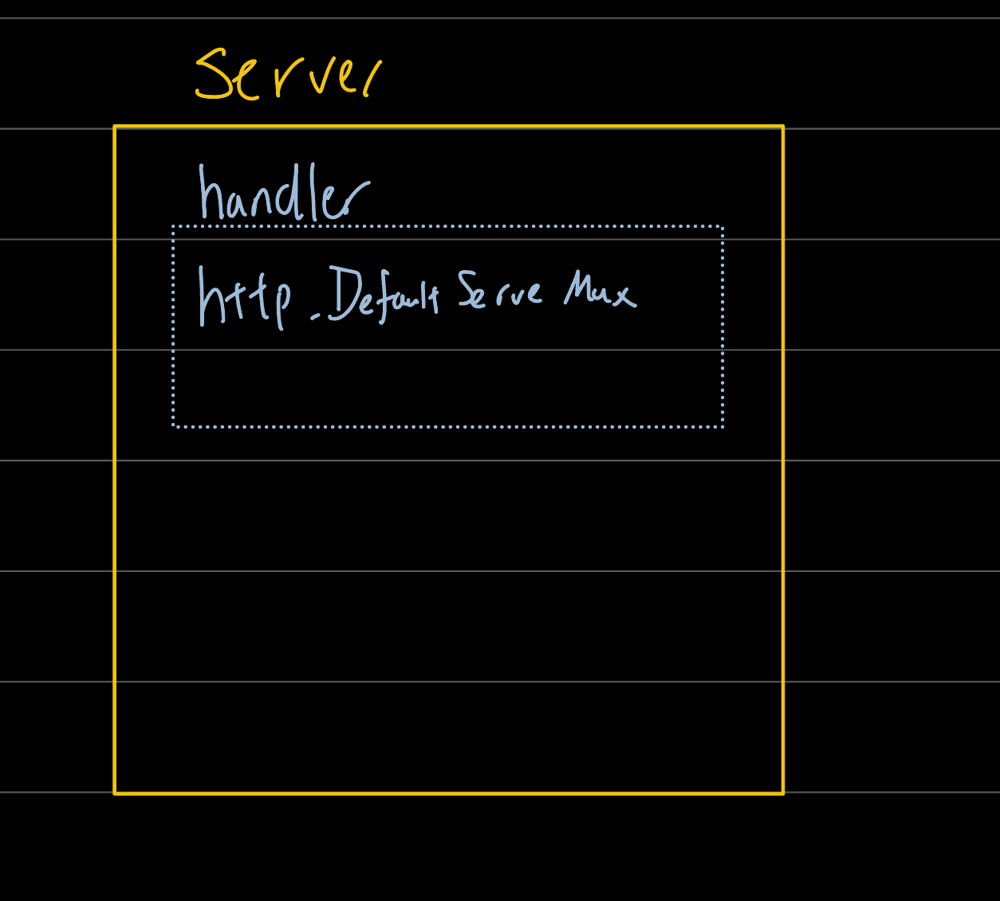
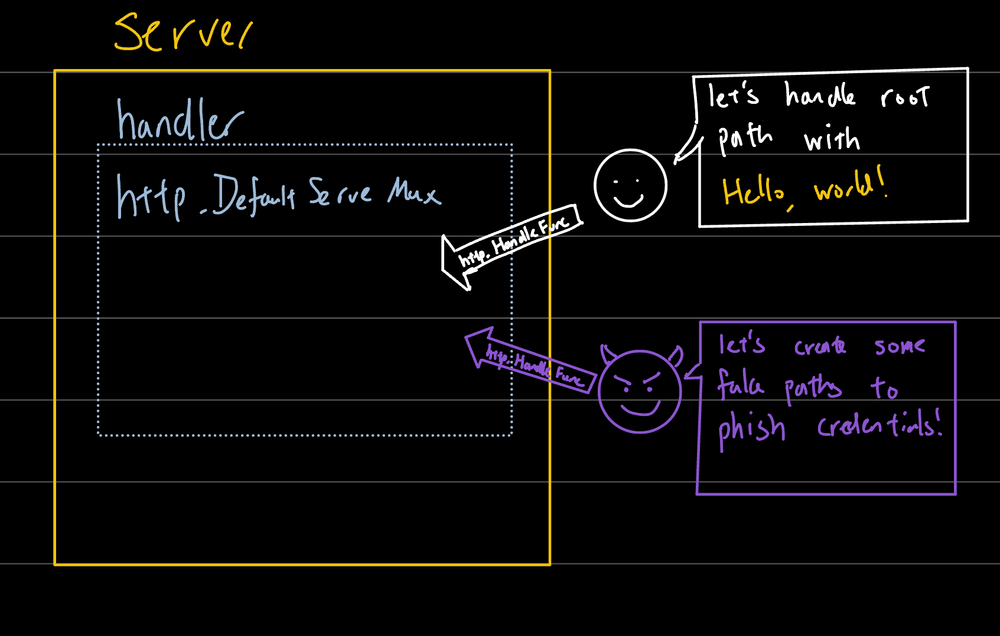

Many go developers rave about the comprehensiveness of go's standard library.

Today, let me share 3 different levels of creating a web server using the standard net/http library.

All 3 examples strive to display "Hello, world!" on localhost:8081/

## 1 - Quick and dirty

- least lines of code

* least secure
* lowest customizability

```go

http.HandleFunc("/", func(w http.ResponseWriter, r *http.Request) {
  w.Write([]byte("Hello, world!"))
})

http.ListenAndServe(":8081", nil)

```

> <sub>Yes... I am a big fan of Infinite Challenge...</sub>

<br>

What if we wanted to handle another path?

e.g.
:8081/ says "Hello, world!"
:8081/bye says "Goodbye, world!"

in the words of [Sir Robin-the-not-quite-so-brave-as-Sir-Lancelot-before-he-was-cast-into-the-Gorge-of-Eternal-Peril](https://youtu.be/VvSO5KEnaVE?si=RB5ynSM4Gb2DWgcl&t=105)

"That's easy!"

```go

http.HandleFunc("/", func(w http.ResponseWriter, r *http.Request) {
  w.Write([]byte("Hello, world!"))
})

http.HandleFunc("/bye", func(w http.ResponseWriter, r *http.Request) {
  w.Write([]byte("Goodbye, world!"))
})

http.ListenAndServe(":8081", nil)

```

not going to post another image. you just have to trust me it works.

<br>

### least secure

let me explain with a picture.



you see.. every golang web server has this internal component called handler.

Like installing different engines in a car, you can specify which handler you want for your server.

We do that by specifying the handler as the 2nd argument of ListenAndServe().

<details>
  <summary>show code</summary>
  
  ```go
  
  http.HandleFunc("/", func(w http.ResponseWriter, r \*http.Request) {
  w.Write([]byte("Hello, world!"))
  })
  
  http.ListenAndServe(":8081", nil) // over here, nil means we do not specify a handler
  
  ```
</details>

By not specifying a handler, the web server employs DefaultServeMux.

(analogous to not specifying the type of engine, thus resulting in car with default engine)

Notice DefaultServeMux is spelt with a capital D. i.e. it is a global public variable?



As easy as it was for you to inject HandleFunc, it could also be that easy for malicious code to be injected into DefaultServeMux.

## 2 - Still quick but less dirty

<details>
<summary>Show code</summary>

File: server.go

```go
package server

func NewHandler() *handler {
  mux := http.NewServeMux()
  mux.HandleFunc("/", func(w http.ResponseWriter, r *http.Request) {
  w.Write([]byte("Hello, world!"))
})
  mux.HandleFunc("/bye", func(w http.ResponseWriter, r *http.Request) {
  w.Write([]byte("Goodbye, world!"))
})
  return &mux
}

```

File: main.go

```go
package main

import (
  "github.com/xxx/yyy/server"
)

handler := server.NewHandler()

http.ListenAndServe(":8081", handler)

```

</details>

That's better. Now our handler is nicely tucked away as a private variable.

We handled (so punny) the not secure part but this is not customizable still.

The astute among you might notice that we can specify the server too!

## 3 - Full customizability

<details>
<summary>Show code</summary>

File: server.go

```go
package server

func NewHandler() *handler {
  mux := http.NewServeMux()
  mux.HandleFunc("/", func(w http.ResponseWriter, r *http.Request) {
  w.Write([]byte("Hello, world!"))
})
  mux.HandleFunc("/bye", func(w http.ResponseWriter, r *http.Request) {
  w.Write([]byte("Goodbye, world!"))
})
  return &mux
}

```

File: main.go

```go
package main

import (
  "time"

  "github.com/xxx/yyy/server"
)

h := server.NewHandler()

s := http.Server{
		ReadTimeout:  1 * time.Second,
		WriteTimeout: 1 * time.Second,
		Handler:      h,
		Addr:         ":8081",
}

s.ListenAndServe()

```

</details>

So now we can specify ReadTimeout, WriteTimeout, etc. To prevent unresponsive/slow clients from exhausting connection pool!

(for other options check net/http documentation [here](https://pkg.go.dev/net/http#Server))

## Conclusion

That was pretty impressive and well thought out by the golang development team.

Reminded me of the Go Proverb "Make the zero value useful"
