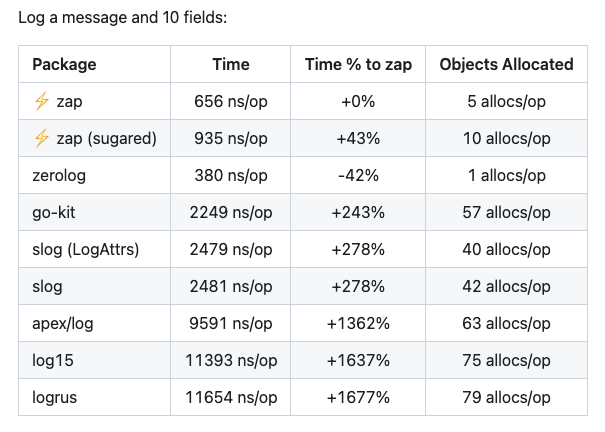
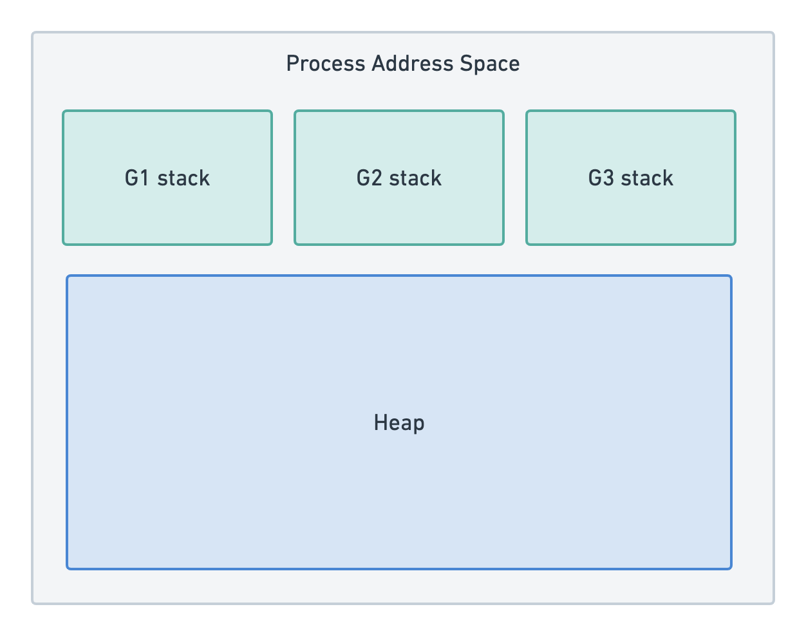
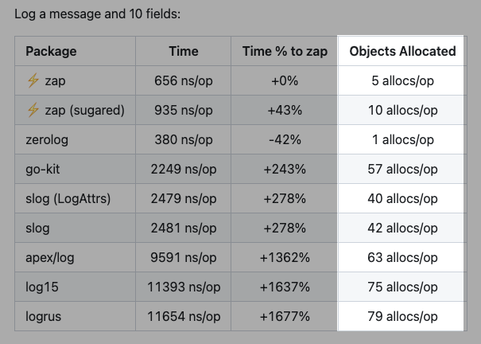
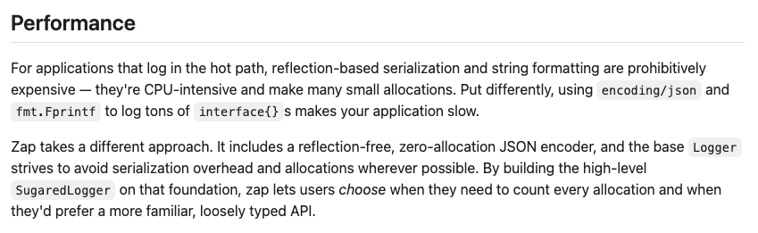
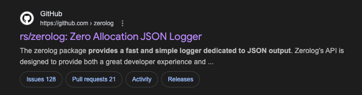

I'm a devout Go standard library guy.

Fact: If you are working on personal projects that don't hit huge scales, Go standard library has you covered most of the time.

So something shiny landed on my plate.

### Enter shiny object --> uber-go/zap


<sub>
"Blazing(ly) fast" - Primeagen</sub>

I had to click in to see!

zap takes about 656 ns/op

slog takes about 2479 ns/op

zap is about 4 times faster!

After scrolling down to the benchmarks, _Gasp_ there is something EVEN FASTER!


<sub>there's something EVEN FASTER!!??!!</sub>

### rs/zerolog --> even faster than zap?!???!

Reading into their GitHub README.md. It seems they took zap's idea and brought it up one more level!

But for a noob like me, what stood out was both packages mentioned **zero-allocation**

### what is zero-allocation?

So a typical program/application is a process provisioned by the OS. With it comes a block of memory on the RAM (technically Virtual address space).


<sub>
The program/app then splits the memory into stack and heap.
</sub>


<sub>
Each goroutine (Go's lightweight thread) gets its own stack, but they all share the same heap.
</sub>

zero-allocation means trying to eliminate heap memory allocation when logging! The goal is to keep everything on the stack or use pre-allocated buffers.

because stack is fast and heap is slow!

### huh? why does it matter if we use stack or heap?

Analogy: let's compare buying takeout for a working lunch meeting versus cooking at home.

#### Takeout

Sometimes we work through lunch, everybody buys their own lunch and has their little plastic bag that contains everything.. utensils, condiments, plastic container.

The serving is perfect for a single meal.

Once you are done with the meal, just make sure everything is in the plastic bag and toss it into the bin.

#### Cooking at home

Sometimes we cook a big batch of food at home (cooking for family, batch cook/meal prep)

We have to think carefully what we want to keep (persist) after this meal.

Condiments, e.g. fried shallots/coriander, should be kept in the fridge if you want to use it for the next meal

#### Why we like takeout

We don't have to mentally keep track of what's in the fridge (or even use fridge space at all!)

### ok bro, answer the question why stack or heap?

Think of Takeout as stack memory.. if we have a function call, we store all the required variables in stack frame (little plastic bag).

Once the function finishes, the entire frame is popped off.

Then Cooking at home is like heap memory.. if we need a variable to persist even after the function ends, then we need to store in the heap. (persisting condiments in the fridge so we can use it for next meal)

But runtime(Garbage Collector) has to continually ask the question, do we still need that ~~condiment~~ variable.

So if we can minimize allocation on the heap.. then BLAZINGLY FAST!

<sub>Notice allocations is proportional to speed!</sub>

### nice bro... why not just force everything to be on the stack.. easy!

sometimes the number of fields we want to log is only determined at runtime.

```go


slog.Info("error", "field1", 123, "field2", "abc"....)
```

what do you do if the number of arguments is not known at compile time?

Ans: use a slice.

Guess where we store the slice?

Ans: The heap.

### damn.. then how does zap get over this?

haha here's an experiment:

1. if a drink is advertised as sugar-free, what does it mean?
2. google "sugar-free", the hyphen/dash is rather important

now we know why it is branded "zero-allocation" and not "zero allocation"


<sub>taken from uber-go/zap README.md</sub>

Just like 'sugar-free' drinks still contains sugar, 'zero-allocation' logging might still allocate in edge cases

**To be fair to zap, it achieves true zero allocation for the common case of static fields. Which is most of the times when we are logging.**

But when fields are truly dynamic (unknown count at runtime), then yes, you need a slice and that requires allocation on the heap.

### it's ~~turtles~~ tradeoffs all the way down

The tradeoff for allocations is verbosity.

What zap offers:

1. Pre-allocate with capacity -> estimate beforehand how many fields
2. Try to fill in as many static fields as you can, and then add in the dynamic fields
3. Suck it up and just let the allocations happen

As we go from 1 to 3, verbosity goes down and heap allocation goes up. If you want speed, you got to write more code.

_With LLM code assistants, this is less of a pain point now! Hurrah!_

```go


// Option 1: Pre-allocate (minimize allocations)
fields := make([]zap.Field, 0, 10) // 1 allocation
for k, v := range data {
    fields = append(fields, zap.String(k, v))
}
logger.Info("event", fields...)

// Option 2: Mix static + dynamic
logger.With(
    zap.Int("user_id", 123),  // static, no alloc
    zap.String("ip", ip),     // static, no alloc
).Info("event", dynamicFields...)

// Option 3: Let it go.. Let it go~~ Can't hold me back anymore!
fields := make([]zap.Field, 0, len(metadata))
for k, v := range data {
    fields = append(fields, zap.Any(k, v))
}
logger.Info("event", fields...)
// difference between this and Option 1 is that we are using zap.Any
// meaning that a field might be a nested struct
// *horror*
```

### p.s. how does zerolog get over allocation in the heap?


<sub>notice the lack of hyphen/dash?</sub>

do you know fluent interface design pattern (where you chain methods to build an object/instance)?

zerolog uses chaining and writes directly to a pre-allocated, pooled buffer - no intermediate Field structs, no slice needed! Each `.Str()`, `.Int()` call immediately writes to the buffer.

### TL;DR - When to use what?

- **Standard library (log/slog)**: Personal projects, most production apps - "fast enough" with great ergonomics
- **Zap**: High-volume logging (100k+ logs/sec), good balance of speed and usability(opposite of verbosity)
- **Zerolog**: Extreme performance needs (when zap is not good enough! _shudders_)

For me? Stick with slog. Optimize later(maybe never)!
